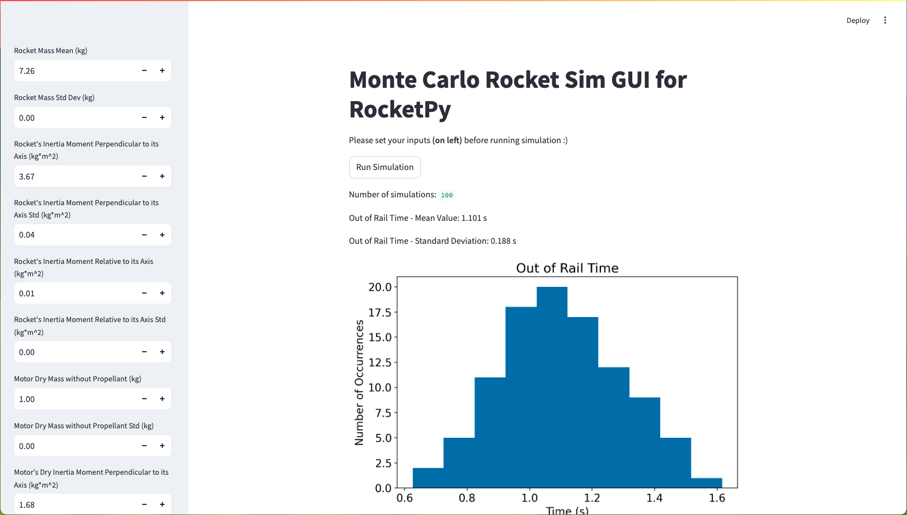
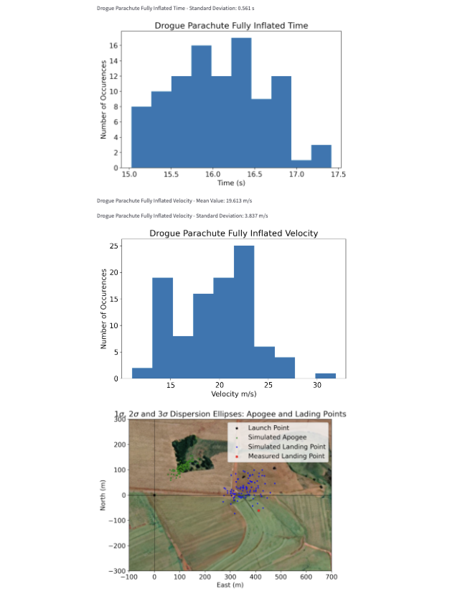

<picture>
  <source media="(prefers-color-scheme: dark)" srcset="https://raw.githubusercontent.com/RocketPy-Team/RocketPy/master/docs/static/RocketPy_Logo_white.png">
  <source media="(prefers-color-scheme: light)" srcset="https://raw.githubusercontent.com/RocketPy-Team/RocketPy/master/docs/static/RocketPy_Logo_black.png">
  
</picture>

<br>

[](https://colab.research.google.com/github/RocketPy-Team/rocketpy/blob/master/docs/notebooks/getting_started_colab.ipynb)
[](https://pypi.org/project/rocketpy/)
[](https://docs.rocketpy.org/en/latest/?badge=latest)
[](https://codecov.io/gh/RocketPy-Team/RocketPy)
[](https://github.com/RocketPy-Team/RocketPy/graphs/contributors)
[](https://discord.gg/b6xYnNh)
[](https://github.com/sponsors/RocketPy-Team)
[](https://www.instagram.com/rocketpyteam)
[](https://www.linkedin.com/company/rocketpy)
[](http://dx.doi.org/10.1061/%28ASCE%29AS.1943-5525.0001331)

<br>

# monte 

<div align="center">
  
</div>

A local GUI for rocket-trajectory calculated with monte-carlo sims through RocketPy.

The simulation outputs the following variables (both mean and std):
- `out of rail time (s)` 
- `out of rail velocity (m/s)`
- `apogee time (s)`
- `apogee altitude (m)`
- `apogee x position (m)`
- `apogee y position (m)`
- `impact time (s)`
- `impact x position (m)`
- `impact y position (m)`
- `impact velocity (m/s)`
- `initial static margin (c)`
- `out of rail static margin (c)`
- `final static margin (c)`
- `maximum velocity (m/s)`
- `drogue parachute trigger time (s)`
- `drogue parachute fully inflated time (s)`
- `drogue parachute fully inflated velocity (m/s)`

The simulation outputs the following graphs:
- `out of rail time | no. of occurences vs. time (s)`
- `out of rail velocity | no. of occurences vs. velocity (m/s)`
- `apogee time | no. of occurences vs. time(s)`
- `apogee altitude | no. of occurences vs. altitude (m)`
- `apogee x position | no. of occurences vs. apogee x position (m)`
- `apogee y position | no. of occurences vs. apogee y position (m)`
- `impact time | no. of occurences vs. time (s)`
- `impact x position | no. of occurrences vs. impact x position (m)`
- `impact y position | no. of occurences vs. impact y position (m)`
- `impact velocity | no. of ocurrences vs. velocity (m/s)`
- `static margin | no. of occurences vs. static margin (c)`
- `maximum velocity | no. of occurences vs. velocity (m/s)`
- `parachute events | no. of occurences vs. no. of parachute events`
- `drogue parachute time | no. of occurences vs. time (s)`
- `drogue parachute fully inflated time | no. of occurences vs. time (s)`
- `drogue parachute fully inflated velocity | no. of occurences vs. velocity (m/s)`
- `1sigma, 2sigma, 3sigma dispersion ellipses: apogee and landing points | north (m) vs. east (m)`

## running the GUI

1.Navigate to
```sh
/docs/notebooks/monte_carlo_analysis/script.py
```

2. In the terminal and within the same directory run the following command:
```sh
streamlit run script.py
```

<div align="center">
  
</div>

### simulation notes
The user may use standard deviation as uncertainty as the simulation runs analogous to both assumptions.

The user may also attempt to add their own variables if required from `script.py`.


The current GUI runs on the files natively given in the `notebooks/monte_carlo_analysis` directory, but in the future, will be dynamic where the user can upload data files from their 6DOF automatically. Currently, the user may need to drag the file manually into the directory.

The user is encouraged to read the `monte_carlo` tutorial from RocketPy which can be found [here](https://github.com/RocketPy-Team/RocketPy/blob/master/docs/notebooks/monte_carlo_analysis/monte_carlo_analysis.ipynb).

## next steps
- dynamic file importing right from GUI
- Dynamic Environment Input instead of current static environment of Valetudo.
- Database of various "parts" of rocket so the user doesn't have to type.
- Analogous to the one directly on top, create rocket presets
- Add more computations.


